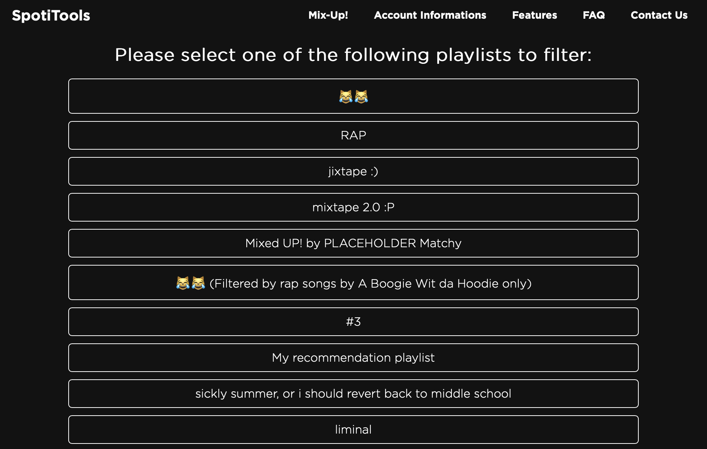
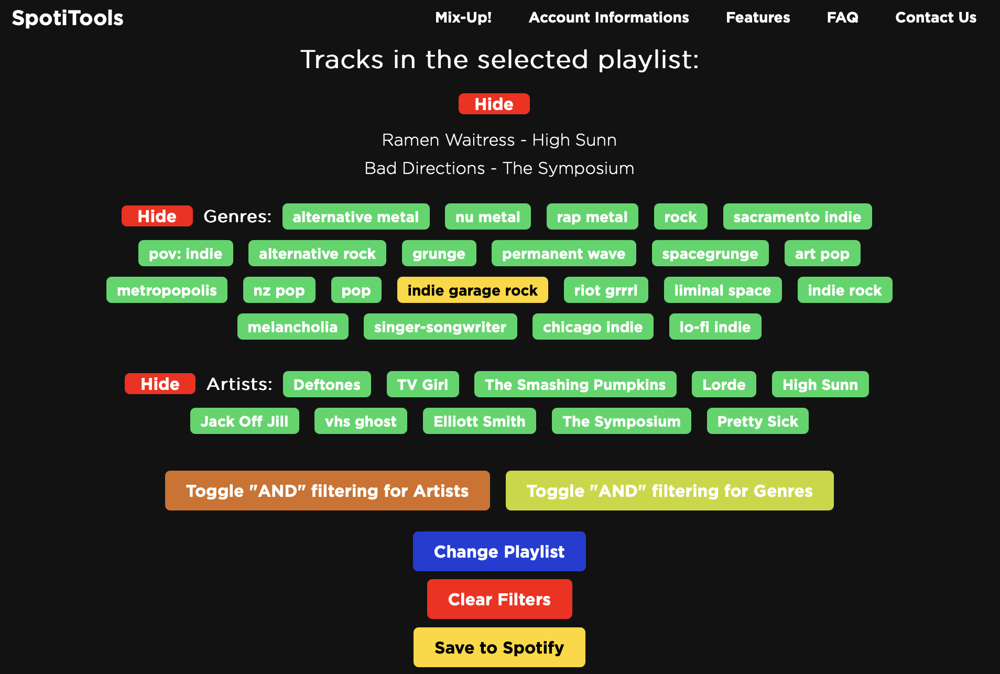
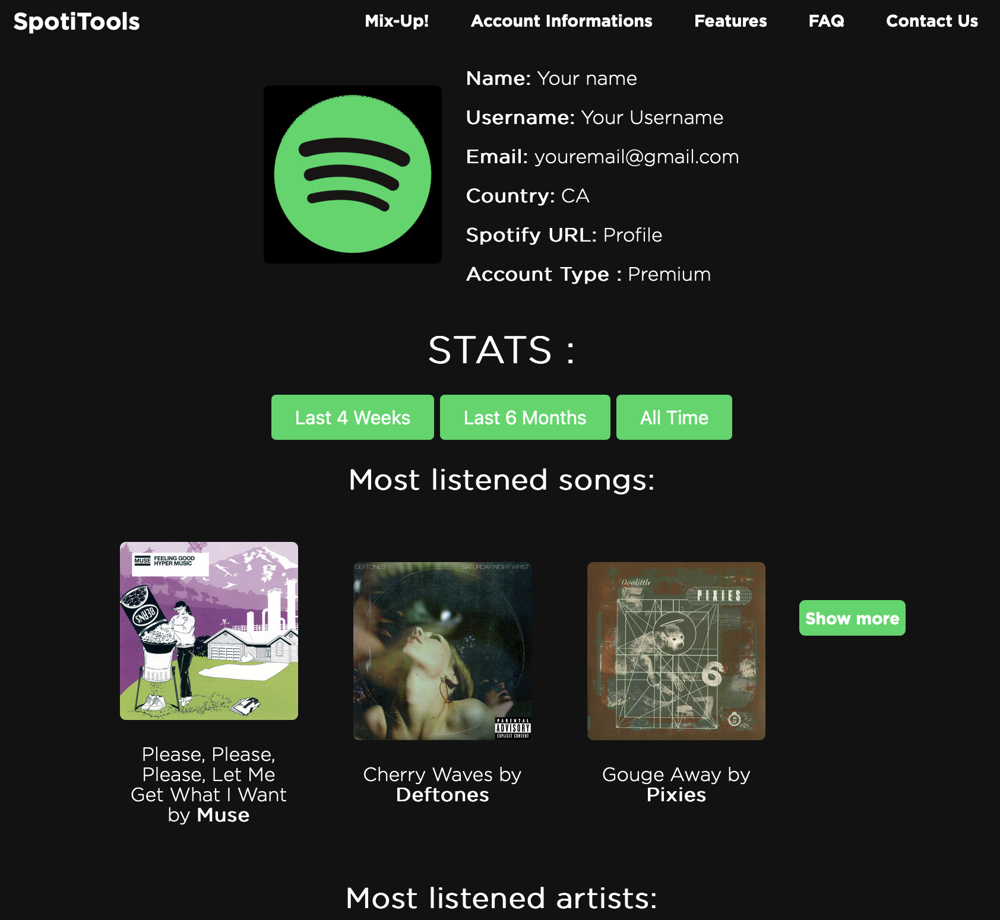
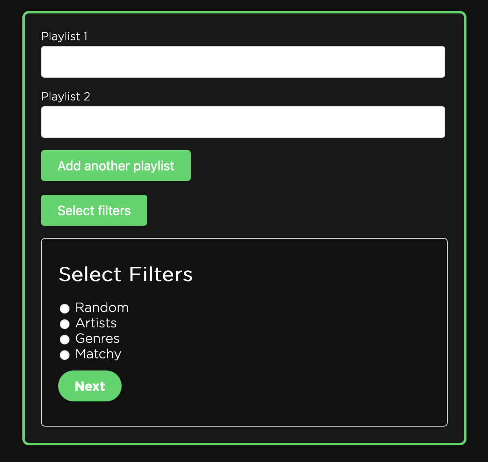

# SpotiTools

## Description

**SpotiTools** is a web application designed to filter and merge Spotify playlists while providing users with detailed information about their Spotify account.  With advanced features to explore artists, genres, and compatibility between multiple playlists, this application aims to enhance the listening experience for Spotify users.

## Features

### Web Version

- **Spotify API Integration**: Connect to the Spotify API to access user data.
- **Playlist Display**: List of playlists created by the user after logging in.

- **Playlist Filtering**: Options to filter playlists by artists and genres.
- **Multiple Filter Selection**: Ability to select multiple filters simultaneously to refine the search.
- **Highlight Selected Items**: Selected artists or genres are highlighted in gold, reverting to green when a new item is selected.
- **Display Songs in a Playlist**: Show details of the songs in a selected playlist.

- **Account Informations**:
  - Most played songs
  - Most listened-to artists
  - Sorting by period of time

- **Playlist Compatibility Filter**: Calculate compatibility between multiple playlists based on shared artists and genres.
- **Playlist Merging**: Merge multiple playlists based on different filters.
  
- **Error Handling**: Ignore errors while loading playlists and continue displaying other data.
- **Responsive User Interface**: Adaptive and dynamic design for a better user experience.

## Technologies Used

- [Spotify API](https://developer.spotify.com/documentation/web-api/)
- HTML, CSS, JavaScript
- Web Development Frameworks (NodeJS)

## Installation

To install and run this project locally:

1. Clone the repository:
   ```bash
   git clone https://github.com/jalalfatouakii/SpotiTools.git
   ```

2. Navigate to the project directory:
   ```bash
   cd SpotiTools
   ```

3. Install dependencies (if applicable):
   ```bash
   npm install
   ```

4. Start the application:
   ```bash
   node proxy-server.js
   ```

5. Launch the application:
   ```bash
   localhost:5001
   ```

## License

This project is licensed under the [MIT](LICENSE) license.

## Acknowledgments

- Thanks to [Spotify](https://www.spotify.com) for their API and [OpenAI](https://www.openai.com) for their assistance in developing this project.
